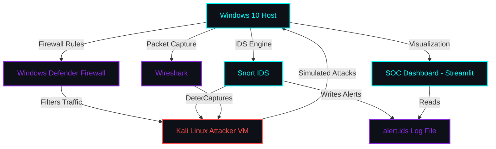
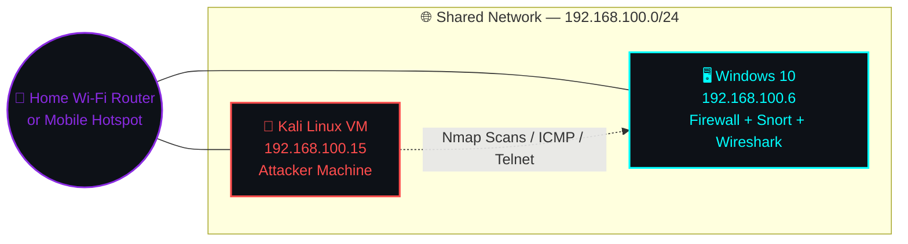
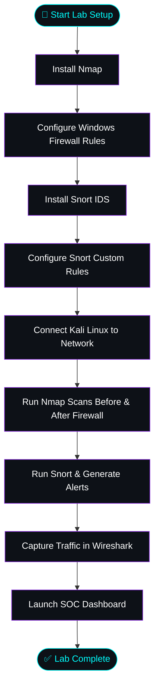
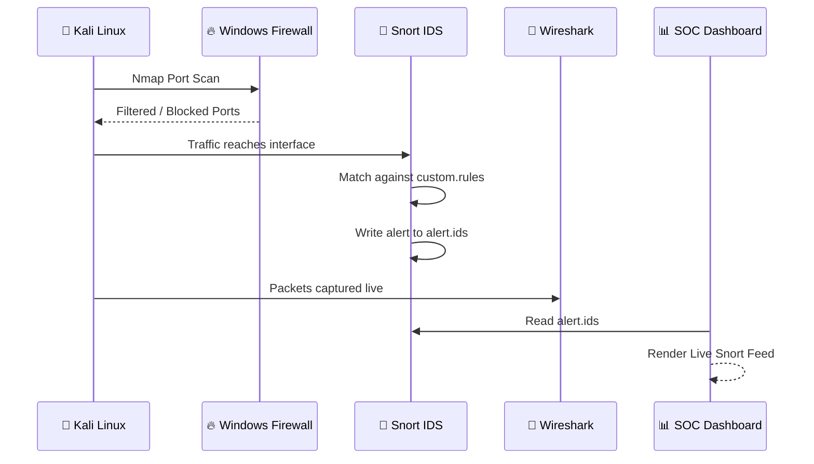
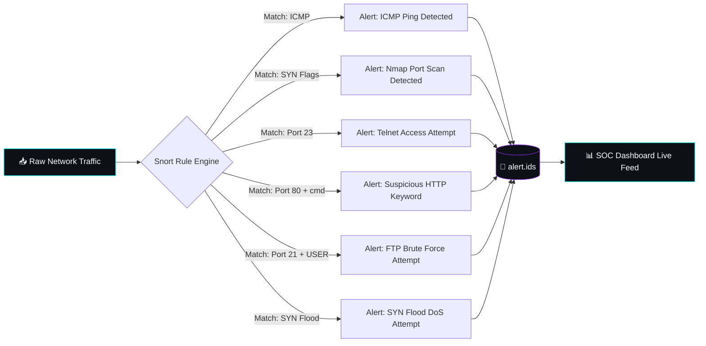

<div align="center">

# 🛡️ FIREWALL & INTRUSION DETECTION SYSTEM

### Enterprise-Grade Network Security Lab — Setup & Configuration Guide

*A complete Firewall + Snort IDS + Wireshark + SOC Dashboard lab environment on Windows 10*

<br/>


<br/>

`/images
/banner.png`

<br/>

</div>

---

## 📋 Table of Contents

- [🧭 Lab Overview](#-lab-overview)
- [🏗️ Architecture](#️-architecture)
- [🌐 Network Topology](#-network-topology)
- [🔄 Workflow](#-workflow)
- [⚙️ Step 1 — Install Nmap on Windows 10](#️-step-1--install-nmap-on-windows-10)
- [🔥 Step 2 — Configure Windows Defender Firewall](#-step-2--configure-windows-defender-firewall)
- [🚨 Step 3 — Install Snort IDS](#-step-3--install-snort-ids)
- [🧩 Step 4 — Configure Snort](#-step-4--configure-snort)
- [🐧 Step 5 — Network Setup: Kali Linux on Same Network](#-step-5--network-setup-kali-linux-on-same-network)
- [🎯 Step 6 — Run Nmap Scans](#-step-6--run-nmap-scans)
- [📡 Step 7 — Run Snort IDS & Generate Alerts](#-step-7--run-snort-ids--generate-alerts)
- [🦈 Step 8 — Capture Traffic in Wireshark](#-step-8--capture-traffic-in-wireshark)
- [📊 Step 9 — Run SOC Dashboard](#-step-9--run-soc-dashboard)
- [🖼️ Screenshots](#️-screenshots)
- [🎬 GIF Demonstrations](#-gif-demonstrations)
- [📺 Demo Video](#-demo-video)
- [📁 Folder Structure](#-folder-structure)
- [🧾 Commands Reference](#-commands-reference)
- [✅ Final Verification Checklist](#-final-verification-checklist)
- [🩺 Troubleshooting Guide](#-troubleshooting-guide)
- [❓ FAQ](#-faq)
- [🚀 Future Improvements](#-future-improvements)
- [🔐 Security Notes](#-security-notes)
- [📚 References](#-references)
- [🤝 Contributing](#-contributing)
- [📄 License](#-license)
- [🙏 Acknowledgements](#-acknowledgements)
- [👤 Author](#-author)

---

## 🧭 Lab Overview

> This guide provides step-by-step instructions for setting up a **complete Firewall and IDS lab environment on Windows 10**. Follow each section in order for best results.

<div align="center">

| Step | Task | Estimated Time |
|:---:|:---|:---:|
| 1️⃣ | Install Nmap on Windows 10 | ⏱️ 5 minutes |
| 2️⃣ | Configure Windows Defender Firewall Rules | ⏱️ 10 minutes |
| 3️⃣ | Install Snort IDS | ⏱️ 15 minutes |
| 4️⃣ | Configure Snort — Custom Rules | ⏱️ 10 minutes |
| 5️⃣ | Connect Kali Linux VM to same network | ⏱️ 10 minutes |
| 6️⃣ | Run Nmap Scan — Before & After | ⏱️ 5 minutes |
| 7️⃣ | Run Snort IDS & Generate Alerts | ⏱️ 10 minutes |
| 8️⃣ | Capture Traffic in Wireshark | ⏱️ 5 minutes |
| 9️⃣ | Run SOC Dashboard | ⏱️ 5 minutes |

</div>

> **⏳ Total Estimated Time:** ~75 minutes

---

## 🏗️ Architecture



---

## 🌐 Network Topology



> ⚠️ **Important:** Both machines **must** be on the same network for attack simulation to work.

`/images/topology.png`

---

## 🔄 Workflow



### 🎯 Attack Flow



### 🔬 Detection Pipeline



---

## ⚙️ Step 1 — Install Nmap on Windows 10

<details open>
<summary><strong>📥 1.1 Download</strong></summary>

<br/>

1. Open browser — go to **[https://nmap.org/download.html](https://nmap.org/download.html)**
2. Find the **"Microsoft Windows binaries"** section
3. Download **"Latest stable release self-installer"** (`.exe` file)
4. Current version: `nmap-7.99-setup.exe`

</details>

<details open>
<summary><strong>💾 1.2 Install</strong></summary>

<br/>

5. Run the downloaded `.exe` file **as Administrator**
6. Click **Next** ➜ **I Agree** ➜ **Next** ➜ **Next** ➜ **Install**
7. When the **Npcap installer** appears — click **Install** (keep defaults)
8. Click **Finish** when complete

</details>

<details open>
<summary><strong>✅ 1.3 Verify Installation</strong></summary>

<br/>

> Open CMD **as Administrator** and run:

```bash
nmap --version
```

**Expected Output:**
```
Nmap version 7.99 ( https://nmap.org )
Platform: i686-pc-windows-windows
```

</details>

---

## 🔥 Step 2 — Configure Windows Defender Firewall

<details open>
<summary><strong>🖥️ 2.1 Open CMD as Administrator</strong></summary>

<br/>

9. Press **Windows key + X**
10. Click **"Command Prompt (Admin)"** or **"Windows PowerShell (Admin)"**
11. Click **Yes** on the UAC prompt

</details>

<details open>
<summary><strong>📜 2.2 Create Firewall Rules</strong></summary>

<br/>

> Run each command **one by one**:

```bat
REM Block Telnet (Port 23)
netsh advfirewall firewall add rule name="Block Telnet" protocol=TCP dir=in localport=23 action=block
```

```bat
REM Allow HTTP (Port 80)
netsh advfirewall firewall add rule name="Allow HTTP" protocol=TCP dir=in localport=80 action=allow
```

```bat
REM Allow HTTPS (Port 443)
netsh advfirewall firewall add rule name="Allow HTTPS" protocol=TCP dir=in localport=443 action=allow
```

```bat
REM Block FTP (Port 21)
netsh advfirewall firewall add rule name="Block FTP" protocol=TCP dir=in localport=21 action=block
```

```bat
REM Block MySQL (Port 3306)
netsh advfirewall firewall add rule name="Block MySQL" protocol=TCP dir=in localport=3306 action=block
```

```bat
REM Enable Dropped Packet Logging
netsh advfirewall set allprofiles logging droppedconnections enable
```

</details>

<details open>
<summary><strong>📶 2.3 Allow ICMP (for Ping Testing)</strong></summary>

<br/>

```bat
netsh advfirewall firewall add rule name="Allow ICMP" protocol=icmpv4:8,any dir=in action=allow
```

</details>

<details open>
<summary><strong>🔎 2.4 Verify Rules</strong></summary>

<br/>

```bat
netsh advfirewall firewall show rule name="Block Telnet"
netsh advfirewall firewall show rule name="Allow HTTP"
netsh advfirewall firewall show rule name="Allow HTTPS"
```

> **✅ Expected:** Each rule shows `Enabled: Yes`, `Action: Block` or `Allow` as configured

</details>

### 📋 Firewall Rules Summary Table

<div align="center">

| Rule Name | Protocol | Port | Direction | Action |
|:---|:---:|:---:|:---:|:---:|
| 🚫 Block Telnet | TCP | 23 | Inbound | `Block` |
| ✅ Allow HTTP | TCP | 80 | Inbound | `Allow` |
| ✅ Allow HTTPS | TCP | 443 | Inbound | `Allow` |
| 🚫 Block FTP | TCP | 21 | Inbound | `Block` |
| 🚫 Block MySQL | TCP | 3306 | Inbound | `Block` |
| ✅ Allow ICMP | ICMPv4 | Type 8 (Echo) | Inbound | `Allow` |

</div>

`/images/firewall.png`

---

## 🚨 Step 3 — Install Snort IDS

<details open>
<summary><strong>📥 3.1 Download</strong></summary>

<br/>

12. Go to **[https://www.snort.org/downloads](https://www.snort.org/downloads)**
13. Download **Snort 2.9.x** Windows installer (`.exe`)
14. Also download **WinPcap** from **[https://www.winpcap.org/install](https://www.winpcap.org/install)**

</details>

<details open>
<summary><strong>🔧 3.2 Install WinPcap First</strong></summary>

<br/>

15. Run `WinPcap_4_1_3.exe`
16. **Next** ➜ **Next** ➜ **Install** ➜ **Finish**

</details>

<details open>
<summary><strong>🐷 3.3 Install Snort</strong></summary>

<br/>

17. Run the **Snort installer as Administrator**
18. **Next** ➜ **I Agree** ➜ **Next** ➜ **Next** ➜ **Install**
19. Default install path: `C:\Snort`
20. Click **Finish**

</details>

<details open>
<summary><strong>✅ 3.4 Verify Snort Installation</strong></summary>

<br/>

```bash
cd C:\Snort\bin
snort --version
```

**Expected Output:**
```
,,_     -*> Snort! <*-
o"  )~   Version 2.9.20-WIN64 GRE (Build 82)
```

</details>

<details open>
<summary><strong>🌐 3.5 Check Available Interfaces</strong></summary>

<br/>

```bash
snort -W
```

> **Expected:** List of network interfaces with IP addresses.
> Find the interface with your Wi-Fi IP (e.g., `192.168.100.6`).
> Note the **Index number** (e.g., `5`).

</details>

---

## 🧩 Step 4 — Configure Snort

<details open>
<summary><strong>📝 4.1 Edit snort.conf</strong></summary>

<br/>

> Open Notepad and edit: `C:\Snort\etc\snort.conf`

Make these changes:

```bat
REM Find and replace these lines:

ipvar HOME_NET 192.168.100.0/24
ipvar EXTERNAL_NET !$HOME_NET

dynamicpreprocessor directory C:\Snort\lib\snort_dynamicpreprocessor
dynamicengine C:\Snort\lib\snort_dynamicengine\sf_engine.dll
```

```bat
REM Comment out this line (add # at start):
# dynamicdetection directory /usr/local/lib/snort_dynamicrules
```

</details>

<details open>
<summary><strong>📁 4.2 Create Required Files</strong></summary>

<br/>

```bat
REM Create empty rules files
echo. > C:\Snort\rules\local.rules
echo. > C:\Snort\rules\custom.rules
```

</details>

<details open>
<summary><strong>🎯 4.3 Add Custom Rules</strong></summary>

<br/>

> Open Notepad, edit `C:\Snort\rules\custom.rules`, and paste these **6 rules**:

```snort
alert icmp any any -> any any (msg:"ICMP Ping Detected"; itype:8; sid:1001; rev:1;)
alert tcp any any -> any 80 (msg:"Suspicious HTTP Keyword - cmd"; content:"cmd"; sid:1002; rev:1;)
alert tcp any any -> any any (msg:"Nmap Port Scan Detected"; flags:S; sid:1003; rev:1;)
alert tcp any any -> any 23 (msg:"Telnet Access Attempt"; flags:S; sid:1004; rev:1;)
alert tcp any any -> any any (msg:"SYN Flood DoS Attempt"; flags:S; sid:1005; rev:1;)
alert tcp any any -> any 21 (msg:"FTP Brute Force Attempt"; content:"USER"; sid:1006; rev:1;)
```

> ⚠️ **Warning:** Save the file with **Ctrl+S** — make sure it is saved as `custom.rules` **not** `custom.rules.txt`

</details>

<details open>
<summary><strong>🔗 4.4 Update snort.conf to Include Custom Rules</strong></summary>

<br/>

In `snort.conf`, find the line:
```
include $RULE_PATH/local.rules
```

Add below it:
```
include $RULE_PATH/custom.rules
```

</details>

### 📊 Custom Snort Rules Reference

<div align="center">

| SID | Rule Name | Trigger Condition |
|:---:|:---|:---|
| `1001` | 🟢 ICMP Ping Detected | ICMP Type 8 (Echo Request) |
| `1002` | 🟠 Suspicious HTTP Keyword | Port 80 traffic containing `cmd` |
| `1003` | 🔴 Nmap Port Scan Detected | SYN flag set, any port |
| `1004` | 🟡 Telnet Access Attempt | SYN flag on port 23 |
| `1005` | 🔴 SYN Flood DoS Attempt | SYN flag flood pattern |
| `1006` | 🟠 FTP Brute Force Attempt | Port 21 traffic containing `USER` |

</div>

`/images/snort.png`

---

## 🐧 Step 5 — Network Setup: Kali Linux on Same Network

<details open>
<summary><strong>🔌 5.1 Connect Both Machines to Same Network</strong></summary>

<br/>

> Both **Windows 10** and **Kali Linux** must be on the **same network** for attack simulation.

<div align="center">

| Option | How | Best For |
|:---|:---|:---|
| 🏠 Home Wi-Fi | Connect both to same home router | ✅ Recommended |
| 📱 Mobile Hotspot | Create hotspot on phone, connect both | No home router available |
| 📦 VirtualBox Bridged | Set Kali adapter to **Bridged** — same Wi-Fi | VM users |

</div>

</details>

<details open>
<summary><strong>📡 5.2 Verify Connectivity</strong></summary>

<br/>

```bat
REM On Windows — check IP:
ipconfig
```
> Note down **IPv4 Address** — e.g., `192.168.100.6`

```bash
# On Kali — check IP:
ip addr show
```
> Note down **inet address** — e.g., `192.168.100.15`

```bash
# Test ping from Kali to Windows:
ping 192.168.100.6
```
> Should get replies — `64 bytes from 192.168.100.6`

> ⚠️ **If ping fails:** Check both are on the same network. If on university Wi-Fi, switch to home Wi-Fi or mobile hotspot — **university Wi-Fi blocks device-to-device communication**.

</details>

---

## 🎯 Step 6 — Run Nmap Scans

<details open>
<summary><strong>🔓 6.1 Before Firewall Rules</strong></summary>

<br/>

> Run this from **Kali Linux BEFORE** applying firewall rules:

```bash
nmap -sS -sV -p 21,22,23,80,443,3306 192.168.100.6
```

**✅ Expected:** Most ports shown as `OPEN`

</details>

<details open>
<summary><strong>🔒 6.2 After Firewall Rules</strong></summary>

<br/>

> Run the same command **AFTER** applying Windows Defender Firewall rules:

```bash
nmap -sS --min-rate 200 192.168.100.6
```

**✅ Expected:** All targeted ports shown as `FILTERED`

> 💡 **Tip:** Screenshot both results for documentation. The difference proves the firewall is working correctly.

</details>

`/images/network.png`

---

## 📡 Step 7 — Run Snort IDS & Generate Alerts

<details open>
<summary><strong>▶️ 7.1 Start Snort</strong></summary>

<br/>

> On Windows CMD (**Run as Administrator**):

```bash
cd C:\Snort\bin
snort -i 5 -c C:\Snort\etc\snort.conf -l C:\Snort\log -A fast
```

> **Note:** Replace `-i 5` with your actual interface number from `snort -W`
> Wait for: `Commencing packet processing (pid=XXXX)`

</details>

<details open>
<summary><strong>⚠️ 7.2 Minimize CMD — Do NOT Close</strong></summary>

<br/>

> 🚫 **Keep Snort running in background.** Open a **new** CMD window for other commands.

</details>

<details open>
<summary><strong>💥 7.3 Simulate Attacks from Kali</strong></summary>

<br/>

```bash
# ICMP Ping Sweep:
ping -c 100 192.168.100.6
```

```bash
# Nmap Port Scan:
nmap -sS --min-rate 200 192.168.100.6
```

```bash
# Telnet Attempt:
telnet 192.168.100.6
```

</details>

<details open>
<summary><strong>📄 7.4 Check Snort Alerts</strong></summary>

<br/>

```bash
type C:\Snort\log\alert.ids
```

**Expected Output Example:**
```
06/11-23:30:12.648105  [**] [1:1003:1] Nmap Port Scan Detected [**]
[Priority: 0] {TCP} 192.168.100.15 -> 192.168.100.6:445
```

</details>

---

## 🦈 Step 8 — Capture Traffic in Wireshark

<details open>
<summary><strong>▶️ 8.1 Start Capture</strong></summary>

<br/>

21. Open **Wireshark**
22. Select the **Wi-Fi interface** (the one with `192.168.100.6`)
23. **Double-click** to start capture

</details>

<details open>
<summary><strong>🔍 8.2 Apply Display Filters</strong></summary>

<br/>

> While Kali sends attacks, apply these filters in Wireshark:

<div align="center">

| Filter | What It Shows |
|:---|:---|
| `icmp` | All ICMP ping packets |
| `icmp.type==8` | Only ICMP Echo Requests (ping) |
| `tcp.flags.syn==1 && tcp.flags.ack==0` | SYN packets — port scan / SYN flood |
| `tcp.port==23` | Telnet traffic |
| `tcp.port==80 && frame contains "cmd"` | HTTP with `cmd` keyword |
| `tcp.port==21` | FTP traffic |

</div>

</details>

<details open>
<summary><strong>💾 8.3 Save Capture</strong></summary>

<br/>

24. Click **File** ➜ **Save As**
25. Save as: `wireshark_capture.pcapng`
26. Take screenshots of each filter for documentation

</details>

`/images/wireshark.png`

---

## 📊 Step 9 — Run SOC Dashboard

<details open>
<summary><strong>📦 9.1 Prerequisites</strong></summary>

<br/>

```bash
# Install Python dependencies:
pip install streamlit pandas plotly
```

</details>

<details open>
<summary><strong>🗂️ 9.2 Setup Dashboard Files</strong></summary>

<br/>

> Create folder `C:\SOC_Dashboard` and place these files inside:

<div align="center">

| File | Purpose |
|:---|:---|
| `app.py` | Main dashboard application |
| `database.py` | SQLite database setup |
| `auth.py` | Authentication module |
| `requirements.txt` | Python dependencies |

</div>

</details>

<details open>
<summary><strong>▶️ 9.3 Run Dashboard</strong></summary>

<br/>

```bash
cd C:\SOC_Dashboard
python -m streamlit run app.py
```

> 🌐 Dashboard will open at: **[http://localhost:8501](http://localhost:8501)**

</details>

<details open>
<summary><strong>🔑 9.4 Login Credentials</strong></summary>

<br/>

<div align="center">

| Username | Password | Role | Access |
|:---:|:---:|:---:|:---|
| `admin` | `admin123` | 👑 Admin | Full access — all pages |
| `analyst` | `analyst123` | 🕵️ Analyst | Security monitoring pages |
| `viewer` | `viewer123` | 👁️ Viewer | Read-only access |

</div>

> 🔐 **Security Note:** These are default lab credentials — change them before any production-like use.

</details>

<details open>
<summary><strong>📡 9.5 Live Snort Feed Setup</strong></summary>

<br/>

> For real-time Snort alerts in the dashboard:

27. Make sure **Snort is running** (Step 7)
28. Open dashboard ➜ Navigate to **Live Snort Feed**
29. Click **Refresh Alerts** button
30. Dashboard reads `C:\Snort\log\alert.ids` automatically

</details>

`/images/dashboard.png`

---

## 🖼️ Screenshots

<div align="center">

| Firewall Rules | Snort Alerts |
|:---:|:---:|
| `/images/firewall.png` | `/images/snort.png` |

| Wireshark Capture | Network Topology |
|:---:|:---:|
| `/images/wireshark.png` | `/images/topology.png` |

| SOC Dashboard |
|:---:|
| `/images/dashboard.png` |

</div>

---

## 🎬 GIF Demonstrations

<div align="center">

`/images/demo.gif`

`/images/snort-demo.gif`

`/images/dashboard-demo.gif`

</div>

---

## 📺 Demo Video

<div align="center">

### ▶️ Watch Complete Demonstration

[](https://youtube.com/your-demo)

`https://youtube.com/your-demo`

</div>

---

## 📁 Folder Structure

```
Firewall-IDS-Lab/
│
├── 📂 images/
│   ├── banner.png
│   ├── dashboard.png
│   ├── snort.png
│   ├── firewall.png
│   ├── wireshark.png
│   ├── topology.png
│   ├── network.png
│   ├── demo.gif
│   ├── dashboard-demo.gif
│   └── snort-demo.gif
│
├── 📂 SOC_Dashboard/
│   ├── app.py                # Main dashboard application
│   ├── database.py           # SQLite database setup
│   ├── auth.py                # Authentication module
│   └── requirements.txt      # Python dependencies
│
├── 📂 Snort/
│   ├── bin/
│   ├── etc/
│   │   └── snort.conf
│   ├── lib/
│   ├── log/
│   │   └── alert.ids
│   └── rules/
│       ├── local.rules
│       └── custom.rules
│
├── wireshark_capture.pcapng
└── README.md
```

---

## 🧾 Commands Reference

<details>
<summary><strong>🔍 Nmap Commands</strong></summary>

<br/>

```bash
nmap --version
```

```bash
nmap -sS -sV -p 21,22,23,80,443,3306 192.168.100.6
```

```bash
nmap -sS --min-rate 200 192.168.100.6
```

</details>

<details>
<summary><strong>🔥 Windows Firewall Commands</strong></summary>

<br/>

```bat
netsh advfirewall firewall add rule name="Block Telnet" protocol=TCP dir=in localport=23 action=block
netsh advfirewall firewall add rule name="Allow HTTP" protocol=TCP dir=in localport=80 action=allow
netsh advfirewall firewall add rule name="Allow HTTPS" protocol=TCP dir=in localport=443 action=allow
netsh advfirewall firewall add rule name="Block FTP" protocol=TCP dir=in localport=21 action=block
netsh advfirewall firewall add rule name="Block MySQL" protocol=TCP dir=in localport=3306 action=block
netsh advfirewall set allprofiles logging droppedconnections enable
netsh advfirewall firewall add rule name="Allow ICMP" protocol=icmpv4:8,any dir=in action=allow
```

```bat
netsh advfirewall firewall show rule name="Block Telnet"
netsh advfirewall firewall show rule name="Allow HTTP"
netsh advfirewall firewall show rule name="Allow HTTPS"
```

</details>

<details>
<summary><strong>🚨 Snort Commands</strong></summary>

<br/>

```bash
cd C:\Snort\bin
snort --version
```

```bash
snort -W
```

```bash
snort -i 5 -c C:\Snort\etc\snort.conf -l C:\Snort\log -A fast
```

```bash
type C:\Snort\log\alert.ids
```

</details>

<details>
<summary><strong>🐧 Kali Linux Commands</strong></summary>

<br/>

```bash
ip addr show
```

```bash
ping 192.168.100.6
```

```bash
ping -c 100 192.168.100.6
```

```bash
telnet 192.168.100.6
```

</details>

<details>
<summary><strong>📊 Dashboard Commands</strong></summary>

<br/>

```bash
pip install streamlit pandas plotly
```

```bash
cd C:\SOC_Dashboard
python -m streamlit run app.py
```

```bash
python -m streamlit run app.py --server.port 8502
```

</details>

---

## ✅ Final Verification Checklist

<div align="center">

| # | Task | Command to Verify | Status |
|:---:|:---|:---|:---:|
| 1 | Nmap installed | `nmap --version` | ⬜ |
| 2 | Snort installed | `cd C:\Snort\bin && snort --version` | ⬜ |
| 3 | Block Telnet rule active | `netsh advfirewall firewall show rule name="Block Telnet"` | ⬜ |
| 4 | Allow HTTP rule active | `netsh advfirewall firewall show rule name="Allow HTTP"` | ⬜ |
| 5 | Custom rules file created | `type C:\Snort\rules\custom.rules` | ⬜ |
| 6 | Snort starts without errors | `snort -i 5 -c C:\Snort\etc\snort.conf -l C:\Snort\log -A fast` | ⬜ |
| 7 | Kali can ping Windows | `ping 192.168.100.6` (from Kali) | ⬜ |
| 8 | Nmap scan shows filtered ports | `nmap -sS 192.168.100.6` (from Kali) | ⬜ |
| 9 | Snort generates alerts | `type C:\Snort\log\alert.ids` | ⬜ |
| 10 | Wireshark captures packets | `icmp` filter shows packets | ⬜ |
| 11 | Dashboard runs | `http://localhost:8501` | ⬜ |
| 12 | Live Snort Feed works | Dashboard ➜ Live Snort Feed ➜ Refresh | ⬜ |

</div>

---

## 🩺 Troubleshooting Guide

<div align="center">

| Problem | Cause | Solution |
|:---|:---|:---|
| ❌ Snort not recognized | PATH not set | Use: `cd C:\Snort\bin` then `snort` command |
| ❌ `alert.ids` is empty | No matching traffic | Disable firewall temporarily, run attacks again |
| ❌ Kali cannot ping Windows | Wrong network | Use home Wi-Fi or mobile hotspot instead of university Wi-Fi |
| ❌ Snort config error | Missing rules files | Run: `echo. > C:\Snort\rules\local.rules` |
| ❌ Dashboard not opening | Port in use | Try: `python -m streamlit run app.py --server.port 8502` |
| ❌ Nmap not found | PATH issue | Run from `C:\Program Files (x86)\Nmap\nmap.exe` |

</div>

---

## ❓ FAQ

<details>
<summary><strong>Why does my Kali Linux VM fail to ping the Windows host?</strong></summary>
<br/>
This is almost always a network isolation issue. University or institutional Wi-Fi networks frequently block device-to-device communication for security reasons. Switch to a home Wi-Fi network or a mobile hotspot, and ensure a VirtualBox-based Kali VM is set to <strong>Bridged Adapter</strong> mode on the same Wi-Fi.
</details>

<details>
<summary><strong>Why is my alert.ids file empty after running Snort?</strong></summary>
<br/>
This typically means no traffic matched your custom rules — often because the Windows Firewall is silently dropping/filtering packets before Snort's interface can observe them. Temporarily disable the firewall, rerun your attack simulations from Kali, and check the log again.
</details>

<details>
<summary><strong>Why do I need WinPcap in addition to Snort?</strong></summary>
<br/>
Snort relies on a packet capture library to read raw traffic off the network interface. On Windows, that library is WinPcap, and it must be installed <strong>before</strong> Snort for the installer/engine to detect network interfaces correctly.
</details>

<details>
<summary><strong>How do I know which interface index to use with Snort?</strong></summary>
<br/>
Run <code>snort -W</code> to list all available interfaces along with their IP addresses. Locate the entry matching your Wi-Fi adapter's IP (e.g., 192.168.100.6) and note its index number — that's the value you pass to the <code>-i</code> flag.
</details>

<details>
<summary><strong>What's the difference between the Admin, Analyst, and Viewer dashboard roles?</strong></summary>
<br/>
Admin has full access to all pages, Analyst can access security monitoring pages, and Viewer has read-only access — allowing you to simulate role-based access control (RBAC) within the SOC Dashboard.
</details>

---

## 🚀 Future Improvements

- 🔄 Automate firewall rule deployment via PowerShell script
- 📧 Add email/SMS alerting for high-priority Snort detections
- 🗄️ Integrate persistent SQL-based alert storage instead of flat-file logs
- 🌍 Extend lab to support multi-VLAN network segmentation
- 🤖 Add machine-learning-based anomaly detection layer
- 📱 Build a mobile-friendly SOC Dashboard view
- 🐳 Containerize the lab environment using Docker for portability

---

## 🔐 Security Notes

> ⚠️ **This lab is intended strictly for educational purposes** in an isolated or controlled lab network.

- 🔑 Change all default dashboard credentials (`admin123`, `analyst123`, `viewer123`) before any extended or shared use
- 🚫 Never expose Snort, the SOC Dashboard, or any lab machine directly to the public internet
- 🧪 Only run attack simulations (Nmap scans, SYN floods, Telnet attempts) against machines **you own or have explicit permission to test**
- 🗂️ Treat `alert.ids` and `wireshark_capture.pcapng` as sensitive artifacts — they may contain network metadata
- 🔒 Disable the firewall **only temporarily** for testing, and always re-enable it afterward

---

## 📚 References

- 🔗 [Nmap Official Downloads](https://nmap.org/download.html)
- 🔗 [Snort Official Downloads](https://www.snort.org/downloads)
- 🔗 [WinPcap Installer](https://www.winpcap.org/install)
- 🔗 [Wireshark Official Site](https://www.wireshark.org/)
- 🔗 [Streamlit Documentation](https://docs.streamlit.io/)
- 🔗 [Windows netsh advfirewall Reference](https://learn.microsoft.com/en-us/windows-server/administration/windows-commands/netsh-advfirewall)

---

## 🤝 Contributing

Contributions, issues, and feature requests are welcome!

1. 🍴 Fork the repository
2. 🌿 Create your feature branch (`git checkout -b feature/AmazingFeature`)
3. 💾 Commit your changes (`git commit -m 'Add some AmazingFeature'`)
4. 📤 Push to the branch (`git push origin feature/AmazingFeature`)
5. 🔁 Open a Pull Request

---

## 📄 License

This project is distributed for **academic and educational purposes** under the University of Management & Technology (UMT) Department of Computer Science.

---

## 🙏 Acknowledgements

- 🏫 **University of Management & Technology (UMT)**, Department of Computer Science
- 🛡️ The **Nmap**, **Snort**, and **Wireshark** open-source communities
- 📊 The **Streamlit** team for making dashboard development effortless

---

## 👤 Author

<div align="center">

### **Malik Abubakar**
`F2024408134` • 4th Semester BS Cybersecurity • UMT Lahore • June 2026

[](https://github.com/your-username)
[](https://linkedin.com/in/your-profile)
[](mailto:your-email@example.com)
[](https://your-portfolio.com)

</div>

---

<div align="center">

### ⭐ If this lab helped you, consider giving it a star!

Made with 💙 and 🛡️ by **Malik Abubakar**

</div>
